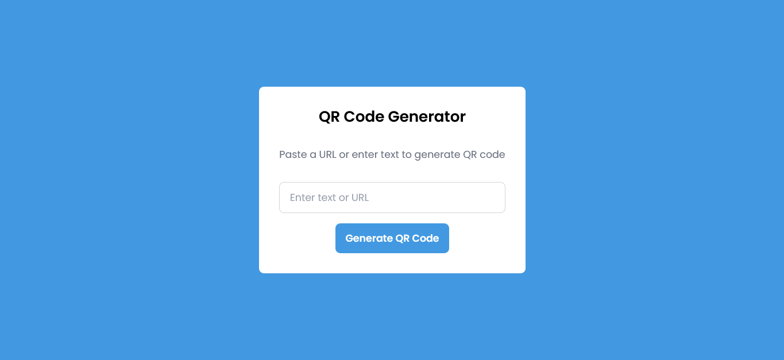

# React QRCode App


React QRCode Application is used to generate QR code images for the given URL address. It was created using HTML5, TailwindCSS and React.js.

## Prerequisites
Before you can run this project, you need to have the following installed:
- Node.js (version 14.0 or later)

## Installation
To install this project, follow these steps:
Clone the repository using `git`
```
git clone https://github.com/Prakashdeveloper03/React-QRCode-App.git
```
Navigate to the root directory of the project
```
cd <directory_name>
```
To install all the dependencies
```
npm install
```
Run the app
```
npm run dev
```

## 📷 Screenshot
